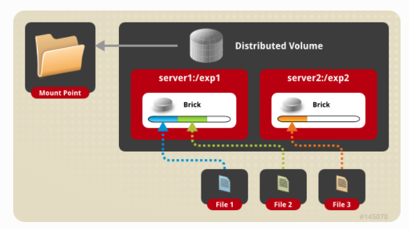
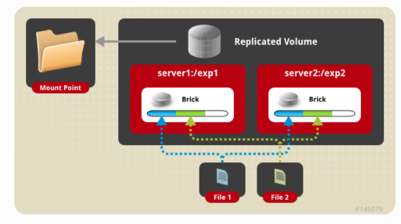
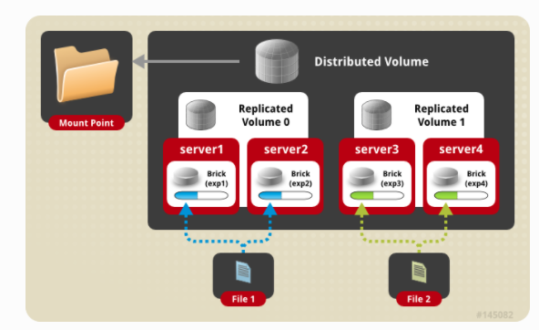
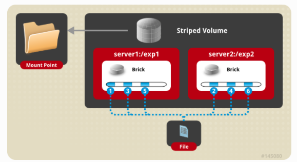
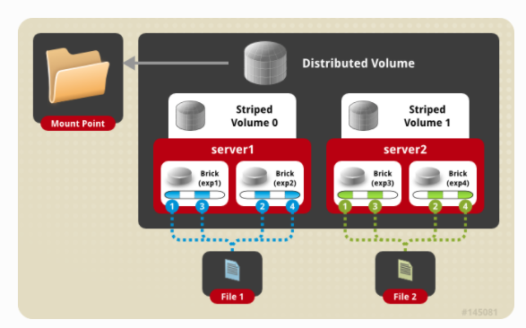

# glusterfs介绍 
Glusterfs是一种分布式的网络存储文件系统，可灵活扩展。他还提供了接口，方便的存储对象、块和文件。具体介绍查看[`Introducing Gluster File System`](http://docs.gluster.org/en/latest/Administrator%20Guide/GlusterFS%20Introduction/)
glusterfs集群的工作流程如下：
- 安装：在servers上安装glusterfs
- 建立TSP：对所有的servers建立信任关系，即建立trusted server pool(TSP)
- 创建bricks（可看成节点上的物理存储）：在TSP中的每台server上，建立glusterfs的最小存储单元——bricks
- 创建volume（可看成集群里的逻辑存储）：基于bricks，创建volume, TSP中的任意个bricks可以组成一个volume
- 客户端挂载：将创建的volume挂载到客户本地, 这样就实现了网络存储。


## Brick
Brick是glusterfs最基本的存储单元，可以将glusterfs节点上的一个挂载目录看成一个brick，前提是该目录是一块独立分区的挂载点。例如：
```
mkdir -p /data/glusterfs/myvol1/brick1
mount /dev/sdb1 /data/glusterfs/myvol1/brick1
```
/data/glusterfs/myvol1/brick1是/dev/sdb1挂载点，那么：
```
mkdir /data/glusterfs/myvol1/brick1/brick
gluster volume create myvol1 replica 2 server{1..4}:/data/glusterfs/myvol1/brick1/brick
```
/data/glusterfs/myvol1/brick1/brick就是一个brick

## Volume
Volume是bricks逻辑上的集合，大多数gluster文件系统都是工作在volume之上。gluster文件系统支持多种volume:

### Distributed Glusterfs Volume

这是默认创建的volume类型，存储方式是：同一个文件只会存在与一个brick里，没有数据冗余，这样设计的目的是为了简单而且廉价地进行volume扩展，同时，也存在数据丢失的可能。
创建：gluster volume create NEW-VOLNAME [transport [tcp | rdma | tcp,rdma]] NEW-BRICK...
```
gluster volume create test-volume server1:/exp1 server2:/exp2 server3:/exp3 server4:/exp4
```

### Replicated Glusterfs Volume
复制卷，克服了数据丢失问题，将同一个文件备份多份到不同的brick里。在创建volume的时候，需要指定replica的数量，例如，我们指定了replica为2，那么就需要至少两个bricks。
创建命令：gluster volume create NEW-VOLNAME [replica COUNT] [transport [tcp | rdma | tcp,rdma]] NEW-BRICK...
```
gluster volume create test-volume replica 2 transport tcp server1:/exp1 server2:/exp2
```

### Distributed Replicated Glusterfs Volume
分布式复制卷，结合了上面两种volume的优势，既能备份数据，又可以扩容。在创建volume的时候，bricks的数量为副本数量的倍数。例如：现在有8个bricks，replica设置为2的话，那么前两个bricks会相互备份数据，3，4bricks会相互备份数据，以此类推。
```
gluster volume create test-volume replica 2 transport tcp server1:/exp1 server2:/exp2 server3:/exp3 server4:/exp4
```

### Striped Glusterfs Volume
如果一个大文件的并发访问量很大，这就会造成单个brick负载很重，性能也会受形象。条数据卷可以解决此类问题，该数据卷将文件分解成多个数据条，存储在不同的bricks中。问题是没有数据冗余。
```
gluster volume create test-volume stripe 2 transport tcp server1:/exp1 server2:/exp2
```


### Distributed Striped Glusterfs Volume
Distributed Striped Glusterfs Volume与Striped Glusterfs Volume类似，唯一不同的是，该Distributed Striped Glusterfs Volume可以被分发到更多bricks上。bricks的数量必须为stripes数量的倍数。
```
gluster volume create test-volume stripe 4 transport tcp
server1:/exp1 server2:/exp2 server3:/exp3 server4:/exp4 server5:/exp5 server6:/exp6 server7:/exp7 server8:/exp8
```



## install
### (1) 配置yum源
内网机器可以配置百度云yum源[`CentOS-Base.repo`](CentOS-Base.repo)和[`epel.repo`](epel.repo)
```
yum clean all
yum makecache
yum update
```
### (2) glusterfs安装
```
yum search centos-release-gluster
yum install centos-release-gluster38
```
修改/etc/yum.repos.d/CentOS-Gluster-3.8.repo中外网的url，配置为百度云的baseurl
```
baseurl=http://mirrors.baidubce.com/centos/$releasever/os/$basearch/
```
安装glusterfs组件
```
yum install glusterfs gluster-cli glusterfs-libs glusterfs-server
```
注意: 使用heketi管理glusterfs，需要独立分区的，并且**没有文件系统**的分区设备，分区之后不要使用mkfs.xxx格式化分区
如果使用heketi，可以跳过分区步骤。(在heketi中会执行类似的步骤)
### (3) XFS bricks
在磁盘/dev/vdb上创建pv
```
pvcreate /dev/vdb
```
在/dev/vdb上创建volume group
```
vgcreate vg_gluster /dev/vdb
```
在volume group上创建xfs逻辑分区brick1和brick2
```
lvcreate -L 5G -n brick1 vg_gluster
lvcreate -L 5G -n brick2 vg_gluster
mkfs.xfs /dev/vg_gluster/brick1
mkfs.xfs /dev/vg_gluster/brick2
```
创建挂载点并挂载
```
mkdir -p /bricks/brick{1,2}
mount /dev/vg_gluster/brick1 /bricks/brick1
mount /dev/vg_gluster/brick2 /bricks/brick2
```
在/etc/fstab中添加：
```
/dev/vg_gluster/brick1  /bricks/brick1    xfs     defaults    0 0
/dev/vg_gluster/brick2  /bricks/brick2    xfs     defaults    0 0
```
至此，在glusterfs节点上创建了两个xfs砖区，挂载在/bricks/brick{1,2}文件夹下。
###  (4) 启动server，信任池创建
```
systemctl enable glusterd.service
systemctl start glusterd.service
gluster peer probe gluster2.example.com  //在一个node上执行即可
```
防火墙设置
```
 firewall-cmd --zone=public --add-port=24007-24008/tcp --permanent
 firewall-cmd --reload
```
### (5) 创建volume
在两个节点集群上，创建一个replica为2的volume

```
mkdir /bricks/brick1/brick
gluster volume create glustervol1 replica 2 transport tcp gluster1.example.com:/bricks/brick1/brick \
gluster2.example.com:/bricks/brick1/brick
gluster volume start glustervol1
```
### (6) 测试
将本地的一个目录/mnt挂载到glusterfs中,命令:mount.glusterfs `<IP or hostname>`:`<volume_name>` `<mount_point>
```
mount -t glusterfs gluster1.example.com:/bricks/brick1/brick /mnt
```
然后在/mnt里创建内容，可以在glusterfs里看见
